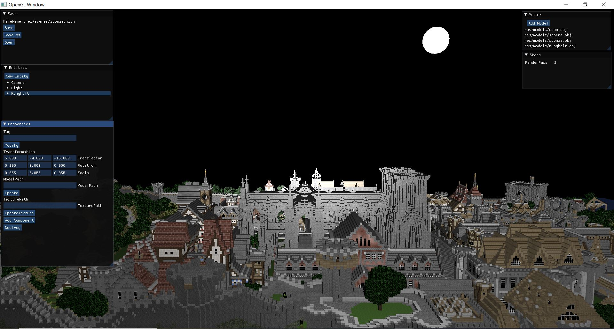

Recursive clone the repository.

Run GenerateBuildvs2022 to create VS2022 solution file.

Open the VS2022 solution file and build. There are currently 2 configurations: Debug and Release.

Functionalities avialable in app:

* Load Model using Add Model
* Load Scene using Open.
* Save to current scene file or save as to a new file.
* Add Entity on runtime
* Add component to the entity on runtime
* Destroy entity
* Update components details on runtime. 

Current Status of Application

